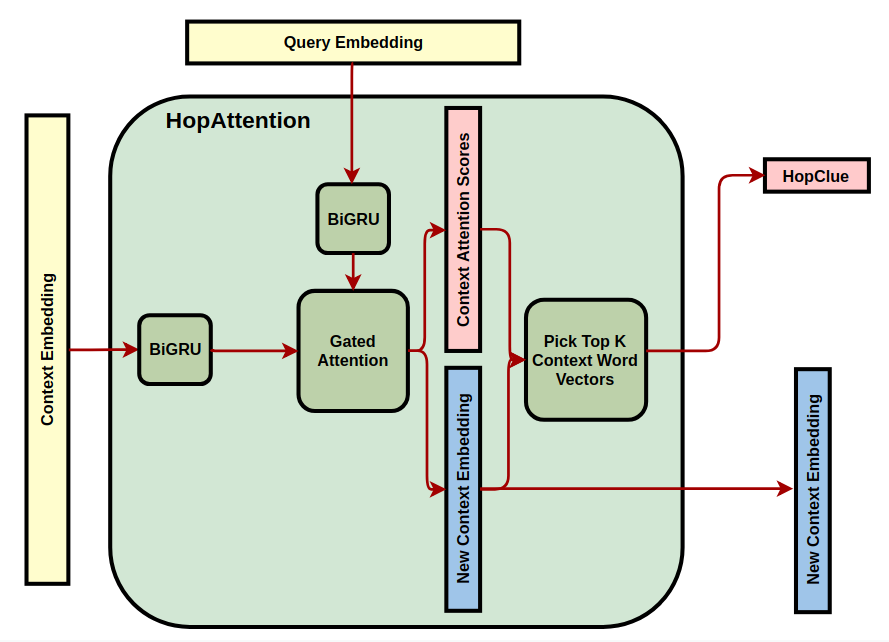

# ReasonHopQA
## Context
State-of-the-art question answering models have difficulty making multi-hop reasoning over long documents.
## Design
Designed a new deep neural network architecture in PyTorch that learns to abstract a “hop clue” vector which guides its
bi-directional attention towards the next reasoning step and its relevant content in the document.

## Result
Model achieves 0.591 F1 score on Wikihop dataset, which is 0.02 higher than “Coreference-GRU” model, a state-of-
the-art model for multi-hop question answering. 
